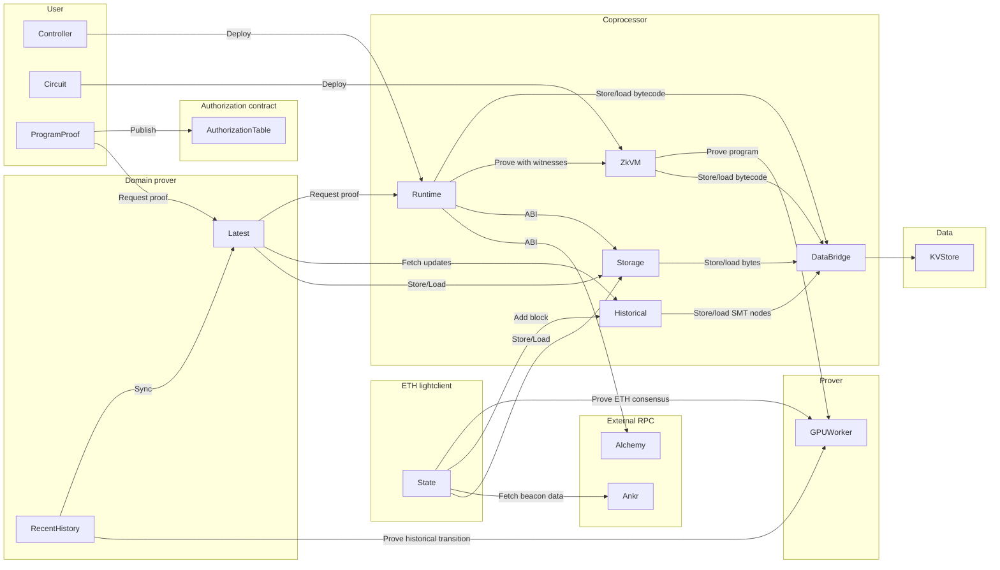

# Valence co-processor

The Valence co-processor functions over zkVMs (Zero-Knowledge Virtual Machines), enabling users to effortlessly develop ZK applications that unify multiple chains through a single proof verification process.

Its main objective is to be user-friendly, ensuring a seamless experience by abstracting the complexities of the zkVMs while maintaining transparency about circuits and witnesses concepts. This allows users to access cross-chain data via light client-verified state proofs.

The service is available publicly at https://service.coprocessor.valence.zone/



#### CLI

The Valence coprocessor utilizes the domain-client as CLI for development, debugging, and deployment tasks.

https://github.com/timewave-computer/valence-domain-clients?tab=readme-ov-file#cli

#### Local execution

The service can be started locally via:

```sh
VALENCE_PROVER_SECRET=secret \
  ALCHEMY_API_KEY=key \
  cargo run -p valence-coprocessor-service
```

It will create an in-memory database and will consume the remote prover service. Note: the environment variable `VALENCE_PROVER_SECRET` must be set in order to be able to consume the dedicated prover. You can request a secret directly with the team. Alternatively, you can use the public service.

You can also customize the log messages via [RUST_LOG](https://rust-lang-nursery.github.io/rust-cookbook/development_tools/debugging/config_log.html):

```sh
VALENCE_PROVER_SECRET=secret \
  ALCHEMY_API_KEY=key \
  RUST_LOG=info,valence_coprocessor=debug,valence_coprocessor_wasm=debug \
  cargo run -p valence-coprocessor-service
```

#### Nix

Alternatively, use Nix for a reproducible development environment:

```sh
# Enter development shell
nix develop

# Start service (equivalent to cargo run-service)
VALENCE_PROVER_SECRET=secret start-service

# Or run directly
nix run .#service
```
