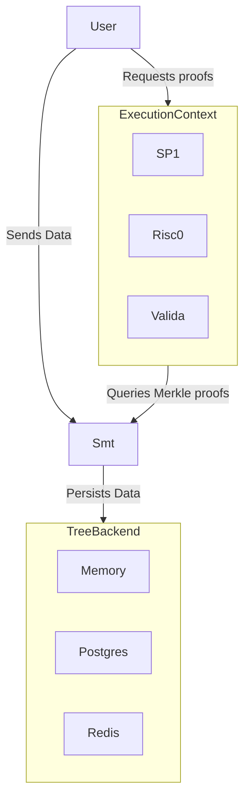
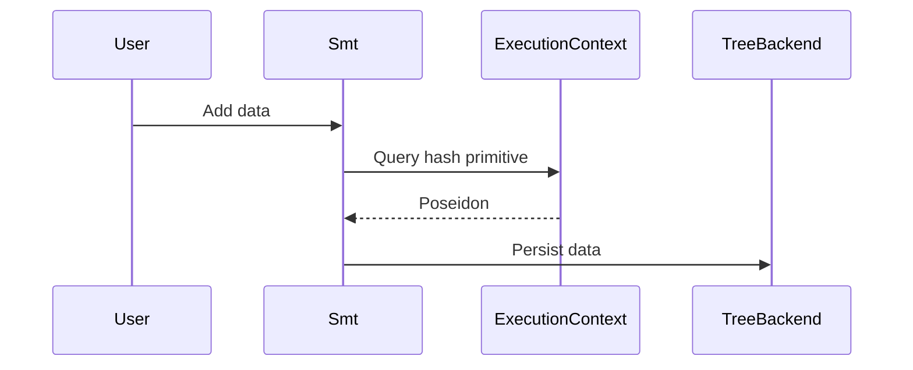
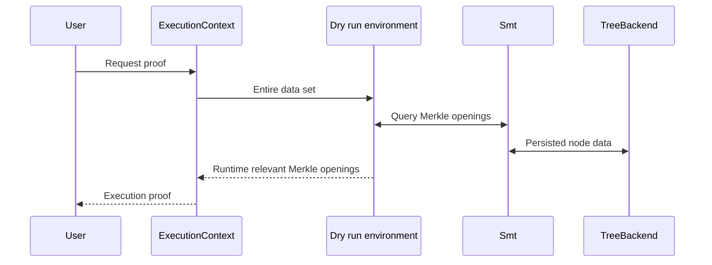

# Valence coprocessor sparse Merkle tree

A sparse Merkle tree implementation for the Valence protocol.

This module utilizes the underlying `TreeBackend` to manage node relationships, encapsulating implementation logic within its own boundaries.

The `ExecutionContext` offers the necessary cryptographic primitives, including a selection of hashes for use during data insertion.

The design employs a binary sparse Merkle tree, with each node categorized as either a pure node, a leaf (associated with a specific leaf key), or containing the related leaf data (a raw byte vector).

Isolated from its data persistence `TreeBackend`, the tree is stateless and can be deployed flexibly across distributed instances of the data backend.

This design strategy aims to boost flexibility and enhance caching on the data backend, as straightforward cache mechanisms like LRU can significantly improve Merkle proof opening, given that certain nodes are frequently accessed.

The decoupling of tree logic from its data backend enables numerous optimization opportunities, since the tree essentially functions as a traversal through nodes.

Upon inserting data into the tree, the first step is to compute the leaf key associated with this data. The key method of the hasher of the execution environment (i.e. `Hasher::key`), which takes a constant context string (acting as a consistent namespace for the data) and the data itself, is responsible for computing the key. After the key is derived, traversal ensues bit by bit, progressively moving from the most significant bit (MSB). If the current bit is `0`, traversal shifts to the left; if it's `1`, it moves to the right.

The implementation is collision safe up to `HASH_LEN` bytes.

### General topology



### Add data sequence



### Proof request



## Example

```rust
// An ephemeral in-memory data backend
#[cfg(feature = "memory")]
async fn run() -> anyhow::Result<()> {
    use valence_smt::MemorySmt;

    let context = "foo";
    let data = b"bar";

    // creates a new instance of the backend
    let mut tree = MemorySmt::default();

    // computes an empty root for inclusion
    let root = MemorySmt::empty_tree_root();

    // appends the data into the tree, returning its new Merkle root
    let root = tree.insert(root, context, data.to_vec()).await?;

    // generates a Merkle opening proof
    let proof = tree.get_opening(context, root, data).await?.unwrap();

    // asserts that the data opens to the provided root
    assert!(MemorySmt::verify(context, &root, &proof));

    Ok(())
}
```
