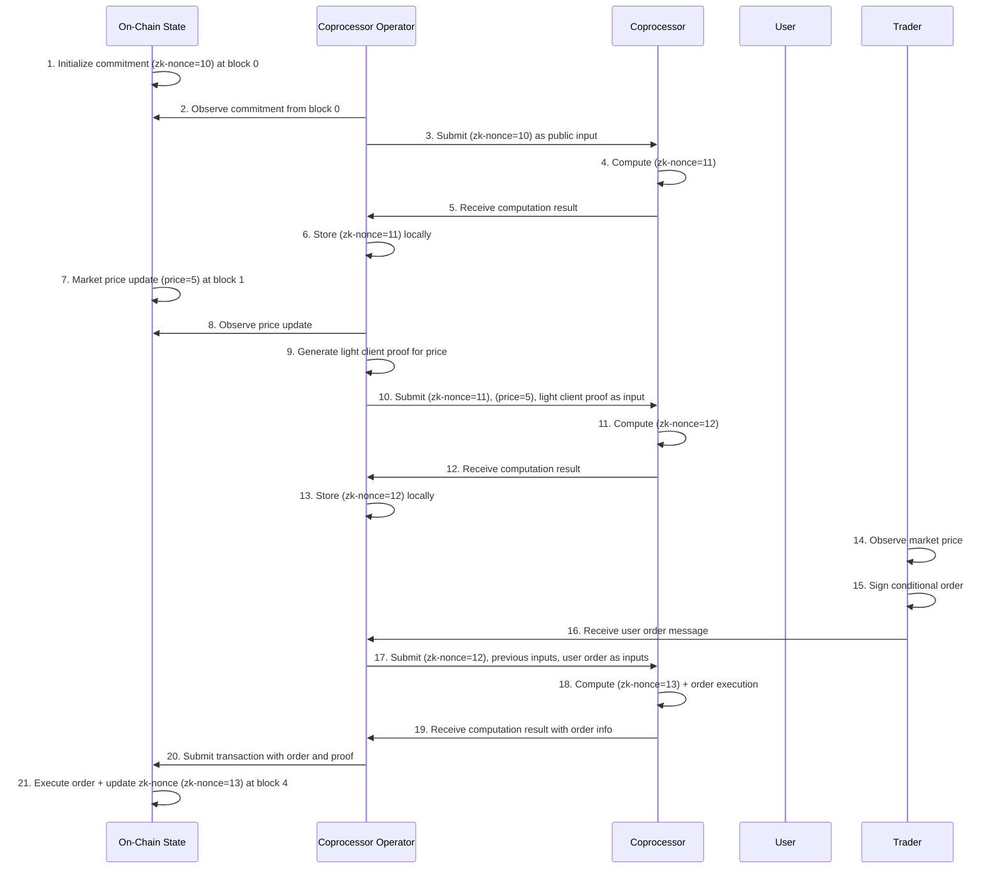
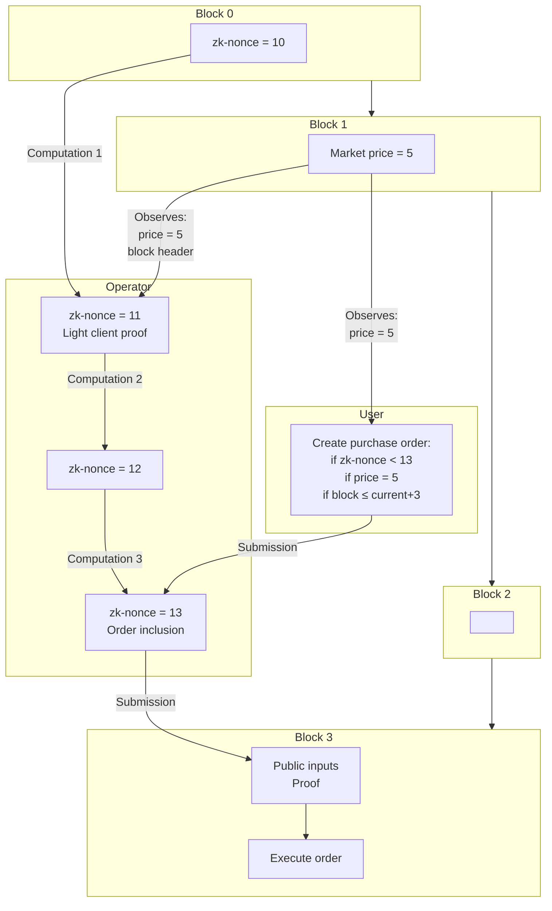

# Async Interaction Patterns with ZK Recursion

This document describes a system that performs recursive zero-knowledge computation enabling verifiable off-chain computation with on-chain anchoring. The system uses a ZK coprocessor operated by a dedicated actor to perform computations, generate proofs, and eventually submit results to the blockchain. For simplicity the Prover, which may be a distinct role in practice, is collapsed into the operator.

#### Example Recusion Flow

1. At block height 0, an on-chain commitment is made with a zk-nonce value of 10.

2. A coprocessor operator observes this commitment and uses it as a public input to the ZK coprocessor.

3. The coprocessor performs a computation that increments the zk-nonce, resulting in a new value of 11. This result remains off-chain at this point.

4. At block height 1, a trader submits a transaction that updates a market price to 5. This transaction is included in the blockchain.

5. The coprocessor operator observes this price update and generates a light client proof verifying the on-chain state.

6. The operator now submits to the coprocessor:
   - The previous computation output (zk-nonce=11)
   - The market state (price=5)
   - The light client proof verifying the market state

7. The coprocessor performs a second computation, resulting in zk-nonce=12. This result again remains off-chain.

8. A user observes the current market price (5) and creates a signed transaction with the following conditions:
   - The zk-nonce must be less than 13
   - The price must be 5
   - The inclusion block height must be ≤ (user's observed block height + 3)
   - If conditions are met, execute a purchase effect

9. The user sends this signed transaction to the coprocessor operator, not directly to the chain.

10. The operator submits to the coprocessor:
    - The previous computation output (zk-nonce=12)
    - All previous public inputs (including the market price)
    - The user's signed transaction

11. The coprocessor performs a third computation, resulting in zk-nonce=13 and a message to execute the user's purchase order.

12. The operator then submits this final result to the blockchain for inclusion at block height 4.

13. The transaction is verified on-chain because:
    - The zk-nonce (13) is valid based on user's condition (< 13)
    - The block height (4) is within the acceptable range
    - The price (5) matches the user's condition
    - The light client proof validates that the price data came from a legitimate block
    - The recursive ZK proof validates the entire computation chain

## Sequence Diagram

This sequence diagram illustrates the interplay between on-chain state, coprocessor operators, the ZK coprocessor itself, users, and other actors able to change blockchain state, illustrated here with traders. Notice the clear separation between on-chain events (which require consensus) and off-chain computation (which requires only ZK verification). The critical paths show how the operator bridges these two domains, gathering inputs, submitting them to the coprocessor, and eventually bringing the results back on-chain.

The diagram highlights the asynchronous nature of the system—the user signs their order based on observed market conditions without direct knowledge of the computational state. Meanwhile, the operator must ensure all conditions remain valid when finally submitting to the chain.

| Step | Public Inputs | Private Witness Data | Verification Key Used | Proof Generated | Notes |
|------|---------------|---------------------|----------------------|-----------------|-------|
| **Initial Commitment** (Block 0) | • Initial nonce value (10) | • None (on-chain value) | • None (direct on-chain state) | • None | This is the starting point anchored on-chain |
| **First Computation** | • Initial nonce (10) | • Internal coprocessor state • Computation steps for incrementing nonce | • Primary circuit VK (`verify_nonce_update`) | • Proof that nonce 10 was correctly incremented to 11 | This proof remains off-chain until later submission |
| **Price Update** (Block 1) | • Market price (5) | • None (on-chain value) | • None (direct on-chain state) | • None | External state change on blockchain |
| **Light Client Proof Generation** | • Block header from Block 1 • Merkle branch to price data | • Full block data • Merkle tree structure | • Light client VK (`verify_eth_state_proof`) | • Proof that price=5 exists in Block 1 state | This connects on-chain state to off-chain computation |
| **Second Computation** | • Previous computation result (nonce=11) • Market price (5) • Block 1 header data | • Previous computation witness • Light client proof witness • Computation steps for price processing | • Recursive circuit VK (`verify_computation_and_state`) | • Proof that given nonce=11 and price=5, the computation correctly produced nonce=12 | First recursive step, combining previous result with new data |
| **User Order Creation** | • User-observed price (5) • User-observed block height | • User's private key | • Signature verification (ECDSA or similar) | • Digital signature on order | Created by user, not part of ZK computation yet |
| **Third Computation** | • Previous computation result (nonce=12) • All previous public inputs • User order with conditions • User signature • Current block height reference | • Previous computation witness • User order verification witness • Computation steps for order processing | • Recursive circuit VK (`verify_computation_order`) | • Proof that given nonce=12, price=5, and valid user order, the computation correctly produced nonce=13 and order execution message | Most complex step, validating multiple conditions and recursively building on previous proof |
| **On-chain Submission** (Block 4) | • Final computation result (nonce=13) • User order execution message • Block references for light client proofs | • Complete recursive ZK proof | • Final verification key (registered on-chain) | • N/A (using the proof, not generating one) | The final proof and public inputs are submitted on-chain for verification |

## Actor Discretion

This table maps the boundaries of each actor's discretion within the system. Coprocessor operators have significant discretion over timing and input selection but cannot manipulate the actual computation. Users have early discretion when formulating orders but surrender control once submitted. Traders influence the system only through price-setting actions, while the coprocessor itself has zero discretion, serving as the deterministic core of the system. The blockchain's discretion is limited to transaction ordering within consensus rules.

| Actor | Discretion | Constraints | Evolution over time |
|-------|-------------|-------------|---------------------|
| **Coprocessor operator** | • Timing of observation • Selection of inputs to include • Order of computation • When to submit results | • Cannot modify input content • Cannot alter coprocessor logic • Must include valid light client proofs | Discretion narrows as user conditions expire or become invalid |
| **User** | • Order parameters • Conditional constraints • When to submit orders • Can issue superseding orders | • Cannot control execution timing • Cannot retroactively invalidate signed orders | Discretion ends after order submission, remaining influence limited to potential superseding orders |
| **Trader** | • Price setting • Timing of trades | • Subject to market mechanisms • Cannot directly control off-chain computation | Discretion is punctuated - high at moment of trade, zero otherwise |
| **Coprocessor (ZK circuit)** | • None - deterministic computation | • Must follow predefined logic • Inputs fully determine outputs | No discretion at any point |
| **Blockchain** | • Block production timing • Transaction inclusion | • Must follow consensus rules • Cannot reject valid transactions | Discretion is constant but constrained by protocol rules |

The evolution of discretion over time is worth noting - user influence frontloads into order creation and gradually diminishes, while operator discretion narrows as conditions approach expiration. This temporal shift in control creates unique game-theoretic dynamics.

### 2. Causal Understanding and Information Asymmetry

In this table we can see the degree of information asymmetry between actors in the system. Operators maintain the most complete picture, with visibility into both on-chain state and off-chain computation. Users operate with limited information about computation state, creating an inherent uncertainty about when and if their orders will execute. Traders influence the system but have minimal visibility into how their actions affect computation. The blockchain itself has the most limited view, knowing only what is committed on-chain.

| Actor | Knowledge of System State | Information Asymmetries | Evolution of Understanding |
|-------|---------------------------|-------------------------|----------------------------|
| **Coprocessor operator** | • Complete view of on-chain state • Full knowledge of previous computations • Awareness of pending user orders | • Cannot know about competing operators' computations until they're submitted • Limited visibility into users' future actions | • Builds a continuously updating causal graph • Information becomes more complete as block height increases |
| **User** | • Access to on-chain state • Knowledge of their own orders • No direct visibility into computation state | • No visibility into operator's computation queue • Cannot know if their order will be included in current recursion • Limited knowledge of other users' actions | • Point-in-time snapshot when creating order • Infers state changes after transaction confirmation |
| **Trader** | • Knowledge of their own trades • On-chain market state | • No visibility into off-chain computation • Limited knowledge of pending orders | • Primarily concerned with immediate market impact • May monitor effects post-trade |
| **Blockchain** | • Canonical record of committed state • No "understanding" of off-chain logic | • No visibility into computation process • Only verifies submitted proofs | • Linear accumulation of state • No causal inference capabilities |

These asymmetries shape strategy and incentives within the system. Operators might batch computations to amortize costs, users might create more flexible conditions to increase execution probability, and traders might monitor post-trade effects to improve future strategy. The evolution of each actor's understanding varies drastically, from the operator's continuously updating view to the user's discrete state observations.

### 3. Provability Matrix

This provability matrix shows how knowledge and verification capabilities evolve across the computation lifecycle. 

| Stage | Coprocessor operator | User | Trader | On-chain verifier |
|-------|----------------------|------|--------------|-------------------|
| **After initial commitment** | • zk-nonce value | • Current on-chain state | • Current price | • Committed zk-nonce |
| **After first computation** | • zk-nonce increment is valid • Computation was correct | • Nothing about off-chain computation | • Nothing about off-chain computation | • Nothing yet |
| **After price update** | • Original zk-nonce valid • Price update occurred • Light client proof is valid | • Current on-chain price | • Trade was executed | • Updated price |
| **After second computation** | • zk-nonce incremented correctly • Price was incorporated • Full computational integrity | • Nothing about off-chain computation | • Nothing about off-chain computation | • Nothing yet |
| **After user order** | • User authorized order • Order meets user conditions • Order can be validly executed | • Order was properly signed • Conditions are valid | • Nothing about pending orders | • Nothing yet |
| **After final computation** | • Complete execution trace is valid • All conditions satisfied • Final zk-nonce is correct | • Nothing until on-chain confirmation | • Nothing about pending orders | • Nothing yet |
| **After on-chain submission** | • Transaction is finalized | • Order was executed • Execution respected conditions | • Order impact on market | • Complete proof validity • All conditions satisfied • zk-nonce updated correctly |

The operator's proof capabilities throughout the process contrast with the limited verification abilities of other actors until final on-chain submission. 

Users, for instance, can only prove facts about their own order submission until the final on-chain commitment provides external verification. Similarly, traders have limited ability to prove anything about the computation despite their price-setting actions being critical inputs.

This asymmetry in provability creates interesting trust dynamics. The system is designed so that complete verification is available once results hit the chain, but prior to that point, different actors have drastically different abilities to verify system state and behavior.

## Cross-chain Message Extension

The system's handling of user-signed messages can be naturally extended to incorporate authenticated messages from other blockchains. Cross-chain messages function as "blockchain-signed messages" in contrast to user-signed messages. They follow the same pattern of authenticated, conditional instructions that are incorporated into the recursive computation, but with different authentication mechanisms and timing properties. From the coprocessor's perspective, both are simply authenticated instructions with conditions attached.

## Causal Evolution

The following diagram illustrates the causal dependencies between events in the system:

## Design Considerations

1. **Operator Competition**: Multiple operators may compete to have their computation accepted on-chain, potentially leading to wasted work. Design considerations:
   - Gas price strategies for prioritization
   - Economic incentives for operator specialization
   - Potential for operator collaboration mechanisms

2. **Proof Aggregation Efficiency**: As the recursion depth increases, proof generation becomes more complex. Important factors:
   - Optimization of proof circuits
   - Batching strategies for related computations
   - Tradeoffs between recursion depth and proof size

3. **Temporal Constraints**: Time-bound conditions create deadline pressures. Considerations:
   - Balancing window sizes for operator flexibility vs user certainty
   - Handling chain reorganizations that might invalidate conditions
   - Strategies for conditions that span multiple block ranges

4. **Failure Modes**:
   - Light client proof invalidation due to deep reorganizations
   - Competing operators causing computation invalidation
   - Malicious operators withholding computations to force condition timeouts

## Applications and Extensions

This recursive ZK computation model enables several applications:

1. **Cross-Chain DeFi**: Atomic operations spanning multiple blockchains with verifiable execution.

2. **Conditional Privacy (assuming client-side proving)**: Transactions that remain private until specific conditions are met.

3. **Batched Optimistic Settlement**: Multiple operations batched together with optimistic execution and ZK fallback verification.

4. **Time-Bound Commitments**: Commitments that automatically execute or expire based on temporal conditions.

5. **Verifiable Event Reaction**: Programmatic, verifiable reactions to on-chain events without requiring on-chain computation for the reaction logic.

## Conclusion

The recursive ZK computation system creates a powerful bridge between off-chain computation and on-chain verification. By leveraging zero-knowledge proofs, light clients, and conditional execution, it enables complex computational flows that maintain verifiability without requiring all computation to occur on-chain.

By balancing actor discretion, information asymmetry, and provability the system creates a nuanced environment where different participants can interact with varying levels of confidence about outcomes, while still maintaining strong guarantees about final state validity. The natural extension to cross-chain messages further amplifies the system's utility by creating a uniform mechanism for handling instructions from both users and other blockchains.
